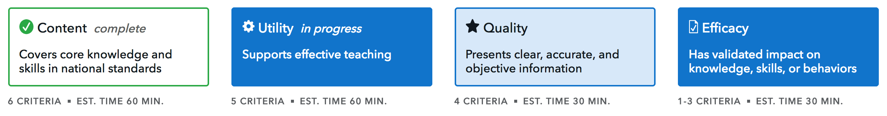

# Curriculum Review Tool

The Curriculum Review Tool is an interactive tool that allows a teacher to assess the merits of a financial education curriculum. It is an alternative to the existing [paper-based tool](https://files.consumerfinance.gov/f/documents/cfpb_youth-financial-education-curriculum-review-tool.pdf). The assessment is made across four dimensions: content, quality, utility, and efficacy. After responding to questions in each of those dimensions, users can print or save a PDF of the assessment results.

The content dimension has three different views based on the grade range (elementary, middle, or high school) selected when beginning a review. The other dimensions are the same for each grade range.

## Technology stack

- The CR Tool is primarily a **React app**.
- It is packaged up in the form of a basic **Django app** for ease of integration with the [consumerfinance.gov](https://github.com/cfpb/consumerfinance.gov) Django project.
- **Jinja2** [is used](crtool/jinja2/crtool/) for HTML templating.
- [**create-react-app**](https://github.com/facebook/create-react-app) was used for initial setup
- `localStorage` [is used](src/js/business.logic/repository.js) to save a user's progress across multiple sessions.
- The app's [JavaScript](src/) is built with basic [**npm scripts**](package.json#L18-L23), but **Gulp** is used to compile the [Less](crtool/css/) into CSS.
- JavaScript is tested with **Jest**.

## Installation for development

The CR Tool will only work fully in the context of consumerfinance.gov.

1. Clone this repository and install it locally into your consumerfinance.gov environment, following [the consumerfinance.gov docs for working on satellite apps](https://cfpb.github.io/consumerfinance.gov/related-projects/#developing-python-packages-with-consumerfinancegov).
1. In this repository's root, run `./setup.sh` to install front-end dependencies and do an initial build.
1. Start your development server
1. Go to http://localhost:8000/consumer-tools/educator-tools/youth-financial-education/curriculum-review/before-you-begin/

If this page doesn't come up, you may need to set the `TDP_CRTOOL` flag to `True` in the Flags section of your local Wagtail admin.

## Running the tests

Run `npm test` to have Jest run the JavaScript unit test suite, which is found in the [`src/__tests__`](src/__tests__) folder.

To reconstruct snapshot data for the tests, run `npm test -- -u`. This will be needed if the content ever changes and the snapshot test fails for that reason. You will also need this while writing new tests for any new pages.

## Development notes

### Templates

The application ultimately serves two Jinja templates at particular URLs:

1. [`crt-start.html`](crtool/jinja2/crtool/crt-start.html)

   This template is served by the `before-you-begin` URL. It contains a small form for setting options for a review in localStorage before starting it.
2. [`crt-survey.html`](crtool/jinja2/crtool/crt-survey.html)

   This template serves the React application for the review interface itself at the `tool` URL. It is nothing more than an empty `
` that serves at the hook for the React app initialization.
   This templates extends the [`crt-base.html`](crtool/jinja2/crtool/crt-base.html) template, which extends the `layout-full` template from consumerfinance.gov, overrides a few things to enforce focusing on the tool, adds in the tool-specific CSS and JS.

### JavaScript

- [`CustomerReviewToolComponent.js`](src/js/components/CustomerReviewToolComponent.js) is the main entry point for the tool.
  - This is where you will find the state properties for the entire app.
  - This is where the flow of the application starts.
  - _TODO:_ Rename this file to correct the "Customer" typo.
- All the business logic for the app is in the [src/js/business.logic/](src/js/business.logic/) folder.
- There are many React components that make up different parts of the app, which are located in the [src/js/components/](src/js/components/) folder.
- There are three major parts of a dimension to be aware of (and remember that the content dimension has three different sets of questions based on grade range):
  1. **Dimension survey pages** – Where the questions about a dimension are presented to the user.
  2. **Dimension summary pages** – Where results of a dimension survey are presented to the user.
  3. **Dimension print page** – Where results of a dimension survey are presented in a non-editable fashion for printing or saving as a PDF.

### Content overview

"Content" refers to any text that is unique to a given dimension that shows up after you click a dimension button.

- Most content can be found in the [src/js/content_data/](src/js/content_data/) folder.
- React code imports a JavaScript file from the `content_data` folder (e.g., [`utilityContent.js`](src/js/content_data/utilityContent.js)) and loops through the objects, passing the content down to the React components to display on the page.
  - Due to time constraints, the `…CriterionPage.js` and `…PrintPage.js` files do not pull the content from the main `content_data` folder, because they were developed before that folder was created. The `…PrintPage.js` files are a step closer to pulling data from the `content_data` folder in that they already reuse other React components. (This makes more sense when you look at the actual file.) The `…CriterionPage.js` files are rather large and have all the content and HTML located in the same file.

#### How to edit content

The easiest way to change content is to search in your editor or filesystem for the text you want to change, change it in all locations it shows up, and submit a PR.

The functionality of this tool is not affected by the content changing.

Both Criterion & Print pages have content in TWO different locations: the `content_data` folder and in their respective locations below.
- Criterion pages (`src/js/components/pages/**/*CriterionPage.js`):
  - ContentElementaryCriterionPage.js
  - ContentMiddleCriterionPage.js
  - ContentHighCriterionPage.js
  - QualityCriterionPage.js
  - UtilityCriterionPage.js
  - EfficacyCriterionPage.js
- Print pages (`src/js/components/pages/**/*PrintPage.js`):
  - ContentElementaryPrintPage.js
  - ContentMiddlePrintPage.js
  - ContentHighPrintPage.js
  - QualityPrintPage.js
  - UtilityPrintPage.js
  - EfficacyPrintPage.js

## Getting help

If you have questions, concerns, bug reports, etc., please file an issue in this repository's issue tracker.

----

## Open source licensing info
1. [TERMS](TERMS.md)
2. [LICENSE](LICENSE)
3. [CFPB Source Code Policy](https://github.com/cfpb/source-code-policy/)
