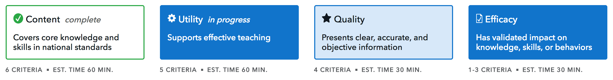

# Curriculum Review Tool

**Description**:  
- The Curriculum Review Tool is a web application that allows a teacher to assess the merits of a financial education curriculum.  The assesment is made accross 4 dimensions "Content", "Quality", "Utility", & "Efficacy".  Once they are done responding to the questions in those dimensions they can print or save as PDF.
- Below is a view of the 4 Dimensions used

- Let it be known of the 4 Dimensions above the Content Dimension has 3 different views based on grade range. Depending the user selection on the start page the Content Dimension will present a different set of questions.

    - Elementary School Content
    - Middle School Content
    - High School Content

### Development Notes
- **Application Break Down**:
  - There are two web forms to this application:
    - [../teachers_digital_platform/jinja2/teachers_digital_platform/crt-start.html](../jinja2/teachers_digital_platform/crt-start.html)
        - This page is a jinja2 template that uses JavaScript to store values in localStorage before redirecting you to the other page.
    - [../teachers_digital_platform/jinja2/teachers_digital_platform/crt-survey.html](../jinja2/teachers_digital_platform/crt-survey.html)
        - This page is an empty template that initates the REACT application that handles the rest of the application.
    - Information is shared between the above two pages via localStorage.

- **Technology stack**: Implemented using REACT with webpack.
    - The Curriculum Review Tool is one of the 3 applications this repository represents, and it has been implemented entirely using REACT.
    - Used the `create react app` when creating the initial app
        - https://github.com/facebook/create-react-app/blob/master/README.md#getting-started
    - This is important because it will now have a webpack.config.js.  Instead we have a package.json and the node_modules folder has defaults set up for us.
    - It should be known we did not use `REDUX` for this application
    - `Uses localStorage`: All localStorage has been implemented in the [teachers_digital_platform/crtool/src/js/business.logic/repository.js](src/js/business.logic/repository.js) file. This abstraction allows the backend to be changed in the future by editing one file.
    - **Setup**: All the code for this tool has been implemented in the  [crtool](../crtool/) folder. (Except for the 2 jina2 templates files)
        - This tool even has its own node modules and scripts 

## Installing the REACT CRTool
- Clone the repository inside the `develop-apps` folder of the cfgov-refresh repository located here: `cfgov-refresh/develop-apps`
- Execute the following script file at the root of the teachers-digital-platform repository
```console
root:~$ ./setup.sh
```

- The build will generate a new crtool.main.js file that is copied to the static/tdp/js folder

## Running Unit Tests for REACT CRTool
- First rebuild the project
    ```console
    root:~$ npm run build
    ``` 
- Execute the jest tests
    ```console
    root:~$ npm test
    ``` 
- Reconstruct snapshot data for the tests
    - This will be needed if the content ever changes and the snapshot test fail for that reason.  You will also need this while writing new tests for any new pages where the non functional screen is in flux.
    ```console
    root:~$ npm test -- -u
    ``` 

## Viewing the app in the local development server:
- The Curriculum Review Tool has been implemented behind a Feature Flag.  You will need to login to the admin and set the flag ```TDP_CRTOOL``` to ```True```
- After you turn the feature flag on navigate here:
 - Actual URL: http://localhost:8000/practitioner-resources/youth-financial-education/curriculum-review/before-you-begin/
    - Ensure you always start with the "before-you-begin" page.  It allows you to get the initial title and grade assignments set before you start the actual tool. (NOTE: The only way to get to the tool is by clicking the begin option from the before-you-begin page unless you know the exact link.)
    - Again since this uses localstorage any time you get to this page you should have the values already in your localstorage


## Development Code Break Down 
- Unit Test can be found under the [../src/__tests__](src/__tests__) folder
  - They are using jest and enzyme
- [../src/js/CustomerReviewToolComponent.js](src/js/components/CustomerReviewToolComponent.js): Is the main entry point for the Survey tool
  - This is where you will find the state properites for the entire app.
  - This is where the flow of the application starts
- All the business logic for the app is in the [../crtool/src/js/business.logic](src/js/business.logic) folder
- There are many react components that make up different parts of the app. Located in the [../crtool/src/js/components](src/js/components) folder. That are organized in different folders (not as organized as I would like).
- There are 3 major parts of a Dimension to be aware of (Remember the Content Dimension has 3 differnet sets of questions based on grade range):
    1) Dimension Survey pages
        - These pages/components are where all the questions are presented to the user
    2) Dimension Summary pages
        - These pages/components are where all results of the survey's are presented to the user with note fields
    3) Final Print/Summary pages
        - These pages are where every thing in the tool is presented in a NON editable fasion for printing or saving as PDF from the print menu.

## Editing Content #
- Master content can be found here:
  - [../src/js/content_data/](src/js/content_data)
  - NOTE: unfortunately time got away from us and the ...CriterionPage.js files did not pull the content from the master location since they were developed before the master content_data folder was created. We look forward to refactoring this out so every thing pulls from the json files in the content_data folder.

### How to edit `Content` Break down ##
1. Start by editing the json files in the [../src/js/content_data/](src/js/content_data) folder.
2. Dimension Survey pages has content in TWO different locations:
    - ../src/js/components/pages/**/*CriterionPage.js
        - ContentElementaryCriterionPage.js
        - ContentMiddleCriterionPage.js
        - ContentHighCriterionPage.js
        - QualityCriterionPage.js
        - UtilityCriterionPage.js
        - EfficacyCriterionPage.js
    - ../src/js/content_data
        - This is where all pages should pull their content from.  Pending a refactor of the CriterionPages.